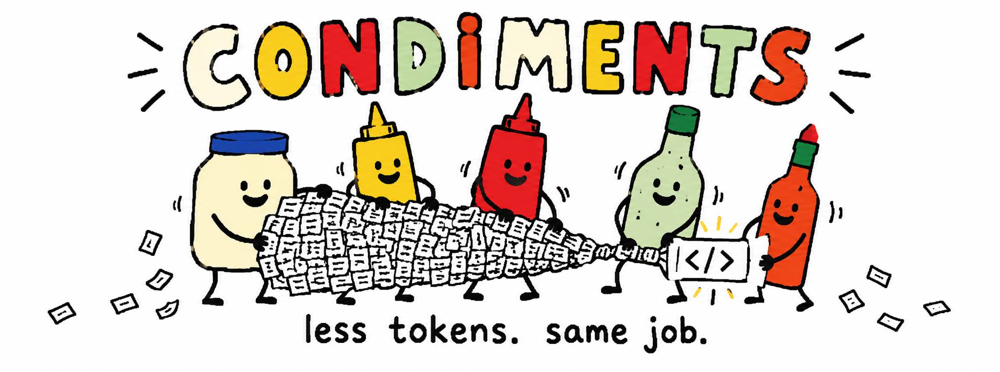

<p align="center">
  
</p>

<h1 align="center">Condiments</h1>

<p align="center">
  Token controls for coding agents. Less context soup, fewer word fries, same required result.
</p>

<p align="center">
  <a href="https://github.com/DotsIsDev/condiments/actions/workflows/ci.yml"></a>
  <a href="https://www.npmjs.com/package/@dotsisdev/condiments"></a>
  <a href="LICENSE"></a>
  <a href="https://skills.sh/DotsIsDev/condiments"></a>
  
</p>

<p align="center">
  <a href="#introduction">Introduction</a> ·
  <a href="#quick-start">Quick Start</a> ·
  <a href="#compatibility">Compatibility</a> ·
  <a href="#results">Results</a> ·
  <a href="#skill">Skill</a> ·
  <a href="#research">Research</a>
</p>

## Introduction

AI coding agents can spend tokens in five broad places: their reply, loaded context, session memory, tool traffic, and reasoning. Condiments gives each area a memorable control:

| Bottle | Controls |
| --- | --- |
| 🥚 `mayo` | Response length, output budgets, and patch-first edits |
| 🟡 `mustard` | Context selection and verification-aware compression |
| 🍅 `ketchup` | Checkpoints, compaction, and reversible memory |
| 🌿 `ranch` | Tool output, schemas, batching, deduplication, and prompt caching |
| 🌶️ `hot` | Reasoning effort and model routing |

Turn every bottle off with `none`, use a quality-first balance with `some`, or squeeze harder with `full`. Individual controls can override the global preset.

Condiments is still a **work in progress**. The command parser, prompt policies, native adapters, telemetry, checkpoints, output governor, query compressor, dictionary encoder, and evaluation harness are implemented. Wider authenticated Claude, Cursor, OpenClaw, Qwen, DeepSeek, and GLM evaluations remain on the menu. Optimization levels describe policy intensity; they are not guaranteed percentages.

The goal is simple: reduce paid and model-visible tokens while preserving the exact files, tests, facts, errors, and citations needed to finish the task.

## Quick Start

### Install from npm (recommended)

[The public npm package](https://www.npmjs.com/package/@dotsisdev/condiments) installs the portable `condiments` and `cond` skills plus the native adapter supported by your host. Node.js 20 or newer is required.

| Environment | Command |
| --- | --- |
| Codex CLI | `npx --yes @dotsisdev/condiments@latest --host codex-cli --target .` |
| Claude Code | `npx --yes @dotsisdev/condiments@latest --host claude-code --target .` |
| Cursor | `npx --yes @dotsisdev/condiments@latest --host cursor --target .` |
| OpenClaw | `npx --yes @dotsisdev/condiments@latest --host openclaw --target .` |

The installer preserves unrelated host settings and records which native capabilities are available. Restart the agent after installation, then invoke `/cond`, `/condiments`, `$cond`, or `$condiments` according to the host.

To upgrade or repair an installation, run the same command with `--force`:

```bash
npx --yes @dotsisdev/condiments@latest --host codex-cli --target . --force
```

You can also install the CLI globally:

```bash
npm install --global @dotsisdev/condiments@latest
condiments --host codex-cli --target .
```

### Install the prompt-only skill

Install globally for Codex from this GitHub repository:

```bash
npx --yes skills add DotsIsDev/condiments --skill condiments -a codex -g
```

Change the agent for another environment:

```bash
npx --yes skills add DotsIsDev/condiments --skill condiments -a claude-code -g
npx --yes skills add DotsIsDev/condiments --skill condiments -a cursor -g
npx --yes skills add DotsIsDev/condiments --skill condiments -a openclaw -g
```

This route installs the portable prompt instructions only. It does not install native hooks, runtime helpers, or host configuration.

### Develop from source

```bash
git clone https://github.com/DotsIsDev/condiments.git
cd condiments
npm install
node scripts/install-adapter.mjs --host codex-cli --target /path/to/project
```

`none` restores captured host configuration where native control exists.

## Compatibility

Condiments targets host capabilities rather than a fixed model allowlist.

| Environment | Models/providers | Invocation | Native additions |
| --- | --- | --- | --- |
| Codex CLI | Models offered by the active Codex host; live evaluation used `gpt-5.6-luna` | `$cond`, `$condiments` | Context management, compaction, large-read guard, cache/reasoning telemetry, capability-gated model routing |
| Claude Code | Claude models available to Claude Code | `/cond`, `/condiments` | Tool-result replacement, checkpoint restore, cache telemetry |
| Cursor | Models available to Cursor Agent | `/cond`, `/condiments` | MCP result replacement, compaction, exposed cache fields |
| OpenClaw | Models configured in OpenClaw | `/cond`, `/condiments` | Tokenjuice interception, `maxTokens`, pruning, compaction, cache retention |
| Direct APIs | OpenAI Responses and Anthropic Messages | Library/CLI helpers | Native output caps, tool-call budgets, cache controls and telemetry when exposed |
| Qwen endpoints | Declared hybrid-thinking models | Request decorator | Capability-gated thinking toggle and budget |

Prompt-level controls remain portable when a host does not expose a native switch. Run `/cond status` to see what the current installation can actually control. Missing telemetry is reported as unavailable, never as zero.

See the full [platform capability matrix](references/platform-capabilities.md).

## Results

Current evidence is promising but deliberately modest. These are workload-specific measurements, not a blanket savings promise.

| Evaluation | `some` | `full` | Quality gate |
| --- | ---: | ---: | --- |
| Live patch-first coding: output tokens | **13.5% less** | **16.2% less** | Tests, exact files, and untouched files passed |
| Live patch-first coding: total tokens | **2.1% less** | **2.9% less** | Same gate passed |
| Live concise answer: output tokens | **18.9% less** | **21.3% less** | Exact answer passed |
| Offline targeted context proxy | **57.6–99.2% less** | **67.4–99.8% less** | 100% exact-symbol recall |
| Initial visible tool-schema bytes | **96.0% less** | **95.9% less** | Required tool result passed |

The tiny concise-answer task used about 1% more total tokens because fixed Codex input overhead outweighed the 31–35 output tokens saved. The live tool-schema experiment also showed no material total-token reduction. Condiments therefore currently claims **about 13–21% measured output reduction and 0–3% measured total reduction on its limited live Codex workloads**. Larger context and repetitive-log reductions are validated byte/token proxies until equivalent provider telemetry is collected.

Read the evidence:

- [Three-repository context evaluation](https://github.com/DotsIsDev/condiments/blob/main/evals/results/latest.md)
- [Patch-first live evaluation](https://github.com/DotsIsDev/condiments/blob/main/evals/results/edit-completion-evaluation.md)
- [Mayo output evaluation](https://github.com/DotsIsDev/condiments/blob/main/evals/results/codex-cli-mayo-output-cap-live.md)
- [Tool-context evaluation](https://github.com/DotsIsDev/condiments/blob/main/evals/results/tool-context-evaluation.md)
- [Lossless log and learned-cap evaluation](https://github.com/DotsIsDev/condiments/blob/main/evals/results/optimal-savings-eval.md)
- [Implementation and evaluation plan](https://github.com/DotsIsDev/condiments/blob/main/docs/IMPLEMENTATION_PLAN.md)

## Skill

### Global commands

| Command | What it does |
| --- | --- |
| `/cond` or `/condiments` | Show current state when used without arguments |
| `/cond status` | Show preset, five effective levels, host, and capability flags |
| `/cond none` | Turn off all Condiments controls and restore supported host settings |
| `/cond some` | Apply balanced, quality-first savings to all five controls |
| `/cond full` | Apply the strongest verified policy to all five controls |
| `/cond reset` | Reset every control to `none` |
| `/cond <control> <level>` | Override one control with `none`, `some`, or `full` |
| `/cond <control>` | Shorthand for setting that control to `full` |

Codex accepts `$cond` and `$condiments`. Text aliases may also trigger the skill implicitly.

### Condiment controls

| Control | Aliases | `some` | `full` |
| --- | --- | --- | --- |
| `mayonnaise` | `mayo` | Concise replies and quality-biased caps | Minimum complete reply, direct edits, task caps of 128/512/2,048 tokens |
| `mustard` | `must` | Load targeted files and retain about 65% of selected evidence | Prefer exact symbols/line regions and target about 35%, while locking required evidence |
| `ketchup` | `ket` | Milestone summaries and checkpoints | Compressed state, reversible memory, and native recovery where supported |
| `ranch` | `ran` | Batch obvious work, bound large output, preserve cache | Aggressive batching, dedupe, schema pruning, dictionary encoding, and cache-lineage protection |
| `hotsauce` | `hot` | Adapt reasoning to task difficulty | Cheapest validated route first; escalate only when required quality is missing |

Examples:

```text
/cond some
/cond mayo full
/cond mustard some
/cond ketchup none
/cond status
```

Correctness wins every food fight. Required edits, tests, paths, identifiers, numeric values, errors, and citations are protected from lossy compression. A failed requirement allows bounded recovery rather than a silent incomplete answer.

See [SKILL.md](SKILL.md) for the complete runtime contract.

## Research

Condiments translates model-training and inference research into controls that black-box coding agents can actually use. Paper percentages below belong to the cited experiments; they are not Condiments results.

Full reviews:

- [Latest algorithmic token-reduction research](research/LATEST_TOKEN_REDUCTION_RESEARCH.md)
- [Chinese token-efficiency research](research/CHINESE_TOKEN_EFFICIENCY_RESEARCH.md)

<details>
<summary><strong>Core algorithmic papers</strong></summary>

- [BINGO — Not All Tokens Matter](https://aclanthology.org/2026.acl-long.726/)
- [Fundamental Limits of Prompt Compression](https://arxiv.org/abs/2407.15504)
- [IterCOMP](https://aclanthology.org/2026.acl-long.1559/)
- [Efficiency vs. Verifiability in Evidence-Aware RAG](https://aclanthology.org/2026.customnlp4u-1.19/)
- [SCOPE](https://arxiv.org/abs/2508.15813)
- [Lossless Prompt Compression via Dictionary-Encoding](https://arxiv.org/abs/2604.13066)
- [REFRAIN — Stop When Enough](https://aclanthology.org/2026.acl-long.1256/)
- [Steering LLM Thinking with Budget Guidance](https://aclanthology.org/2026.findings-acl.1866/)
- [Thinking with Reasoning Skills](https://aclanthology.org/2026.acl-industry.154.pdf)
- [Ada-RS](https://aclanthology.org/2026.acl-industry.88/)
- [Extra-CoT](https://arxiv.org/abs/2602.08324)
- [HAB — Thinking Economically](https://aclanthology.org/2026.findings-acl.1965/)
- [Step Pruner — Beyond Token Length](https://aclanthology.org/2026.findings-acl.94/)
- [O1-Pruner](https://aclanthology.org/2026.findings-acl.697/)
- [LightThinker++](https://arxiv.org/abs/2604.03679)
- [TALE — Token-Budget-Aware LLM Reasoning](https://aclanthology.org/2025.findings-acl.1274/)
- [LLMLingua-2](https://aclanthology.org/2024.findings-acl.57/)
- [Perception Compressor](https://aclanthology.org/2025.findings-naacl.229/)
- [TokenSkip](https://aclanthology.org/2025.emnlp-main.165/)
- [Qwen3 Technical Report](https://arxiv.org/abs/2505.09388)
- [Qwen3 thinking-budget implementation](https://github.com/QwenLM/Qwen3/blob/main/docs/source/getting_started/thinking_budget.md)

</details>

<details>
<summary><strong>Provider and agent implementation references</strong></summary>

- [OpenAI model optimization guidance](https://developers.openai.com/api/docs/guides/latest-model)
- [Unrolling the Codex agent loop](https://openai.com/index/unrolling-the-codex-agent-loop/)
- [OpenAI agent-harness efficiency](https://openai.com/index/gpt-5-6-frontier-intelligence-efficiency/)
- [Anthropic cost and intelligence optimization](https://platform.claude.com/docs/en/about-claude/models/optimizing-for-cost-and-intelligence)
- [Claude Code costs](https://code.claude.com/docs/en/costs)
- [Anthropic tool-context management](https://platform.claude.com/docs/en/agents-and-tools/tool-use/manage-tool-context)
- [OpenClaw session pruning](https://docs.openclaw.ai/concepts/session-pruning)
- [OpenClaw prompt caching](https://docs.openclaw.ai/reference/prompt-caching)
- [OpenClaw compaction](https://docs.openclaw.ai/reference/session-management-compaction/compaction)
- [OpenClaw subagents](https://docs.openclaw.ai/tools/subagents)
- [Cursor summarization](https://docs.cursor.com/en/agent/chat/summarization)
- [Cursor model router](https://prod.cursor.com/docs/cursor-router)
- [Cursor agent-harness improvements](https://cursor.com/blog/continually-improving-agent-harness)
- [DeepSeek context cache](https://api-docs.deepseek.com/zh-cn/guides/kv_cache/)
- [DeepSeek FIM completion](https://api-docs.deepseek.com/zh-cn/api/create-completion/)
- [Alibaba Model Studio context cache](https://help.aliyun.com/zh/model-studio/context-cache)
- [Alibaba Qwen deep thinking](https://help.aliyun.com/zh/model-studio/deep-thinking)
- [Alibaba Qwen Coder](https://help.aliyun.com/zh/model-studio/qwen-coder)
- [AgentScope compaction](https://java.agentscope.io/v2/zh/docs/harness/compaction)
- [AgentScope memory](https://java.agentscope.io/v2/zh/docs/harness/memory)
- [Zhipu GLM thinking controls](https://docs.bigmodel.cn/cn/guide/capabilities/thinking)

</details>

## Repository Map

| Path | Purpose |
| --- | --- |
| `SKILL.md` | Portable agent-skill contract |
| `adapters/` | Host-specific skill manifests and capability declarations |
| `src/` | Core policy, telemetry, compression, memory, and routing modules |
| `scripts/` | User-facing CLIs, hooks, installers, and evaluations |
| `references/` | Runtime design and capability documentation |
| `research/` | Primary-source research reviews |
| `docs/` | Maintainer implementation and publishing guides |
| `evals/` | Workloads, fixtures, schemas, and measured results |
| `test/` | Deterministic Node.js test suite |
| `sidecars/` | Optional learned-compression bridge |

## Contributing

Ideas, workload traces with secrets removed, provider telemetry adapters, and reproducible evaluations are welcome. Read the [contribution guide](https://github.com/DotsIsDev/condiments/blob/main/CONTRIBUTING.md) before opening a pull request.

## License

[MIT](LICENSE) © DotsIsDev contributors.
