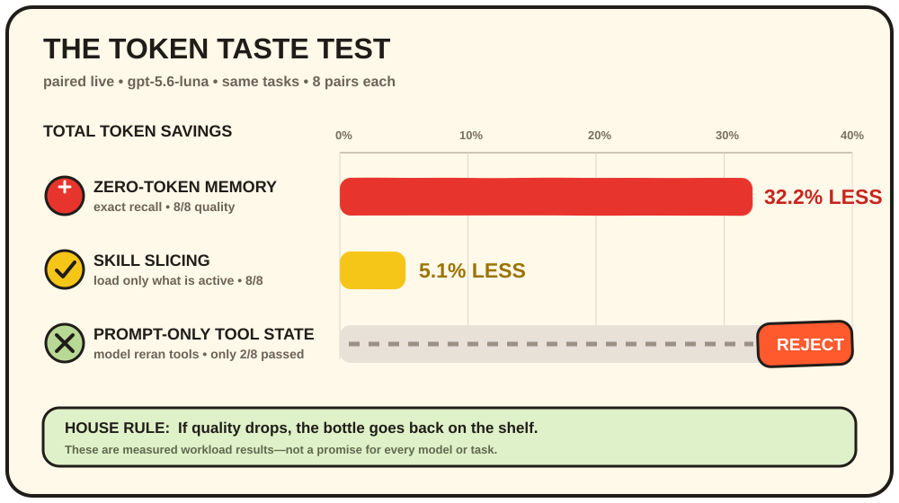
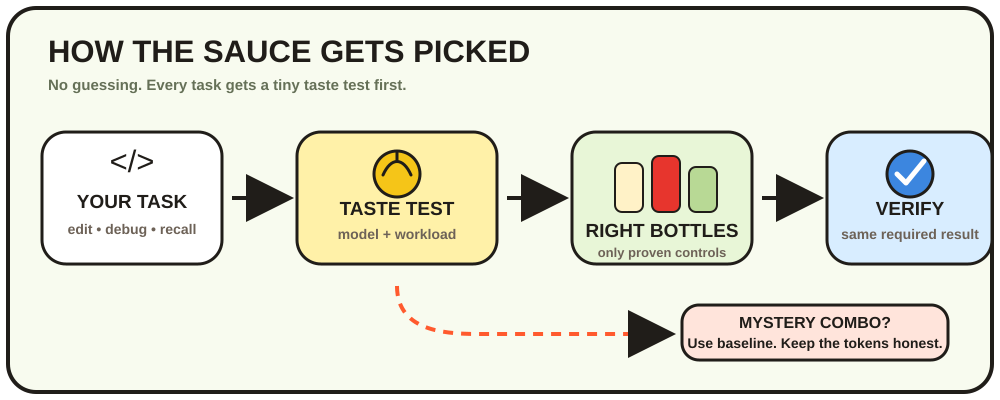
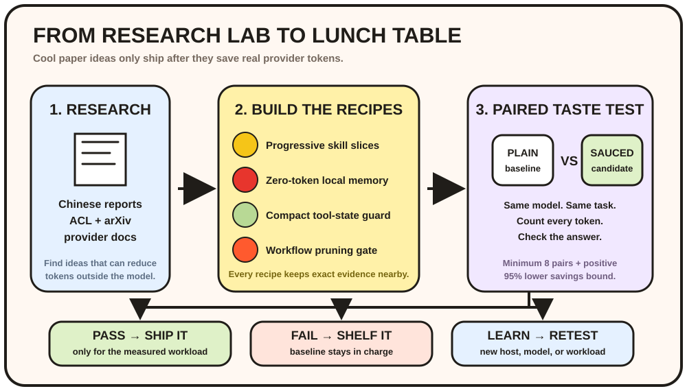

<p align="center">
  
</p>

<h1 align="center">Condiments</h1>

<p align="center">
  <strong>Your coding agent is hungry. Give it the right sauce.</strong><br>
  Token controls for coding agents: less context soup, fewer word fries, same required result.
</p>

<p align="center">
  <a href="https://github.com/DotsIsDev/condiments/actions/workflows/ci.yml"></a>
  <a href="https://www.npmjs.com/package/@dotsisdev/condiments"></a>
  <a href="LICENSE"></a>
  <a href="https://skills.sh/DotsIsDev/condiments"></a>
  
</p>

<p align="center">
  <a href="#-grab-a-bottle">Install</a> ·
  <a href="#-meet-the-bottles">Bottles</a> ·
  <a href="#-the-scoreboard">Results</a> ·
  <a href="#-how-the-sauce-gets-picked">How it works</a> ·
  <a href="#-from-research-to-recipe">Research</a>
</p>

---

## 🚀 Grab a bottle

Install for Codex in the current project:

```bash
npx --yes @dotsisdev/condiments@latest --host codex-cli --target .
```

Restart Codex, then choose a strength:

```text
/cond full
```

That is it. Condiments checks the model and task, adds only proven controls, and keeps mystery combinations on baseline.

<details>
<summary><strong>Install for Claude Code, Cursor, OpenClaw, or every Codex project</strong></summary>

| Where | Command |
| --- | --- |
| Claude Code | `npx --yes @dotsisdev/condiments@latest --host claude-code --target .` |
| Cursor | `npx --yes @dotsisdev/condiments@latest --host cursor --target .` |
| OpenClaw | `npx --yes @dotsisdev/condiments@latest --host openclaw --target .` |
| Codex everywhere (PowerShell) | `npx --yes @dotsisdev/condiments@latest --host codex-cli --target "$env:USERPROFILE"` |
| Codex everywhere (Bash) | `npx --yes @dotsisdev/condiments@latest --host codex-cli --target "$HOME"` |

Add `--force` to update or repair an installation.

</details>

---

## 🍟 Meet the bottles

| Bottle | Nickname | Job | Full squeeze |
| :---: | --- | --- | --- |
| 🥚 | **Mayo** | Trims replies | Smallest complete answer |
| 🟡 | **Mustard** | Picks context | Loads exact files, symbols, and evidence |
| 🍅 | **Ketchup** | Remembers | Retrieves exact local memory before summarizing |
| 🌿 | **Ranch** | Handles tools | Batches, deduplicates, and bounds noisy output |
| 🌶️ | **Hot Sauce** | Controls thinking | Starts cheap and turns up effort only when needed |

Use `none` to put every bottle away, `some` for a light squeeze, or `full` for the strongest validated recipe.

---

## 📊 The scoreboard

<p align="center">
  
</p>

> **Official measured claim:** Condiments produced **5.1–32.2% fewer total tokens** in its validated Luna workloads with no quality loss. This is a measured range, not a promise for every task.

| What happened | Decision |
| --- | --- |
| Zero-token memory: **32.2% less**, 8/8 exact recalls | ✅ Ship for validated Luna recall |
| Progressive skill disclosure: **5.1% less**, 8/8 checks | ✅ Use on active routes |
| Prompt-only tool state: model reran tools in 6/8 pairs | 🛑 Require native blocking |
| Unknown model or workload | 🧊 Stay on baseline |

The complete numbers live in the [48-run paired evaluation](evals/results/net-savings-controls-live.md).

<details>
<summary><strong>What about the other experiments?</strong></summary>

- Luna debugging and noisy-command workloads saved **20.4–23.2% logical tokens**, but cache-cost savings remain unproven.
- General Luna tasks, Sol exact edits, and Astra exact edits showed regressions, so the router keeps them on baseline.
- Context and tool-schema experiments showed large byte reductions, but Condiments does not label those as provider-token savings.
- Reasoning savings are still estimates until authenticated provider A/B runs finish.

[Open every evaluation and methodology note](#-proof-locker).

</details>

---

## 🧭 How the sauce gets picked

<p align="center">
  
</p>

Condiments treats `/cond full` as a **ceiling**, not an order to optimize everything. If a combination has not passed paired testing, it receives no extra policy.

```text
known winner  → tiny active recipe
unknown combo → baseline
quality drop  → reject and recover
```

---

## 🧪 From research to recipe

<p align="center">
  
</p>

### Four ideas became working controls

| Recipe | What Condiments built | Current label |
| --- | --- | :---: |
| 🧩 **Progressive disclosure** | Stable core + current host + active bottles only | ✅ Validated |
| 🧠 **Zero-token memory** | Local exact-evidence index with zero model calls | ✅ Validated |
| 🧰 **Compact tool state** | Hash-addressed results, facts, gaps, and retry blocking | 🛡️ Native guard only |
| ✂️ **Workflow pruning** | 8-pair quality, confidence, and break-even gate | ✅ Active gate |

Read the source reviews:

- [Chinese net-token savings update](research/CHINESE_NET_TOKEN_SAVINGS_UPDATE_2026-09-20.md)
- [Chinese token-efficiency research](research/CHINESE_TOKEN_EFFICIENCY_RESEARCH.md)
- [Latest algorithmic token-reduction research](research/LATEST_TOKEN_REDUCTION_RESEARCH.md)
- [DeepSeek-V4.1-Flash report](research/DeepSeek_V41_Tech_Report.md)

---

## 🎮 Command menu

| Command | Effect |
| --- | --- |
| `/cond` | Show the current sauce |
| `/cond full` | Strongest validated recipe |
| `/cond some` | Lighter quality-first recipe |
| `/cond none` | Plain baseline |
| `/cond ranch full` | Change one bottle |
| `/cond status` | Show levels and host abilities |
| `/cond v` | Show the installed release |

`/condiments` accepts the same commands. Codex also accepts `$cond` and `$condiments`.

---

## 🤖 Where it works

| Agent or API | Skill commands | Native extras |
| --- | :---: | --- |
| **Codex** | ✅ | Compaction, large-read guard, routing, cache/reasoning telemetry |
| **Claude Code** | ✅ | Tool-result replacement, checkpoints, cache telemetry |
| **Cursor** | ✅ | MCP result replacement, compaction, cache fields |
| **OpenClaw** | ✅ | Tokenjuice, pruning, compaction, cache retention |
| **OpenAI / Anthropic APIs** | Helpers | Reasoning, output caps, cache controls, state reuse |
| **Qwen / DeepSeek** | Helpers | Capability-gated thinking and reasoning controls |

Run `/cond status` to see what the current installation can control. Missing telemetry is shown as unavailable—never as zero.

---

## 🔬 Proof locker

<details>
<summary><strong>Measured results</strong></summary>

- [Net-savings controls: 48 paired live runs](evals/results/net-savings-controls-live.md)
- [Savings-controls replication](evals/results/savings-controls-evaluation-v0.1.4.md)
- [Paired live evaluation](evals/results/paired-live-evaluation-v0.1.4.md)
- [Patch-first coding](evals/results/edit-completion-evaluation.md)
- [Mayo output](evals/results/codex-cli-mayo-output-cap-live.md)
- [Tool context](evals/results/tool-context-evaluation.md)
- [Lossless logs and learned caps](evals/results/optimal-savings-eval.md)
- [Three-repository context evaluation](evals/results/latest.md)

</details>

<details>
<summary><strong>Rules for honest savings</strong></summary>

1. Count input, output, reasoning, cache traffic, retries, helpers, and failures.
2. Compare the same model, effort, task, and starting state.
3. Keep exact files, tests, facts, errors, and citations correct.
4. Require at least eight paired samples before workflow pruning.
5. Publish failures too. A shorter answer is not a saving if the task needs another turn.

</details>

<details>
<summary><strong>Core papers and provider references</strong></summary>

- [BINGO — Not All Tokens Matter](https://aclanthology.org/2026.acl-long.726/)
- [IterCOMP](https://aclanthology.org/2026.acl-long.1559/)
- [REFRAIN — Stop When Enough](https://aclanthology.org/2026.acl-long.1256/)
- [Lossless Prompt Compression via Dictionary-Encoding](https://arxiv.org/abs/2604.13066)
- [TALE — Token-Budget-Aware LLM Reasoning](https://aclanthology.org/2025.findings-acl.1274/)
- [LLMLingua-2](https://aclanthology.org/2024.findings-acl.57/)
- [Qwen3 Technical Report](https://arxiv.org/abs/2505.09388)
- [OpenAI agent-harness efficiency](https://openai.com/index/gpt-5-6-frontier-intelligence-efficiency/)
- [Anthropic cost and intelligence optimization](https://platform.claude.com/docs/en/about-claude/models/optimizing-for-cost-and-intelligence)
- [DeepSeek context cache](https://api-docs.deepseek.com/zh-cn/guides/kv_cache/)

</details>

---

## 🛠️ Builder corner

<details>
<summary><strong>Develop from source</strong></summary>

```bash
git clone https://github.com/DotsIsDev/condiments.git
cd condiments
npm install
npm test
node scripts/install-adapter.mjs --host codex-cli --target /path/to/project
```

| Pantry shelf | What is inside |
| --- | --- |
| [`SKILL.md`](SKILL.md) | Portable skill contract |
| [`src/`](src/) | Policies, routing, memory, telemetry, compression |
| [`scripts/`](scripts/) | Installer, hooks, helpers, evaluations |
| [`references/`](references/) | Runtime and platform notes |
| [`research/`](research/) | Full paper reviews |
| [`evals/`](evals/) | Workloads, fixtures, and results |
| [`test/`](test/) | Deterministic test suite |

</details>

Contributions are welcome. Bring reproducible workloads, sanitized traces, provider adapters, or a clever new sauce. Start with [CONTRIBUTING.md](CONTRIBUTING.md).

---

<p align="center">
  <strong>Correctness wins every food fight.</strong><br>
  <a href="LICENSE">MIT License</a> © DotsIsDev contributors
</p>
